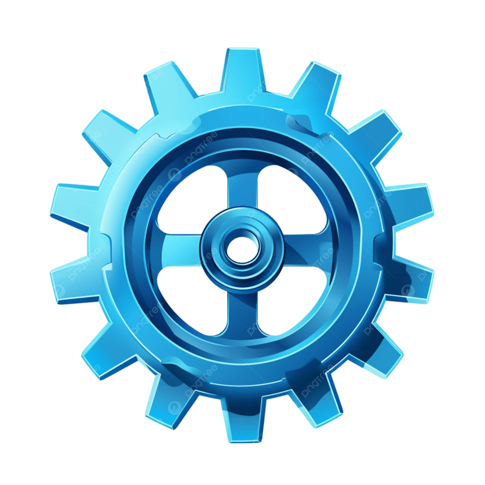

[Home](./) | [About](about.md) | [Case Studies](projects.md)

<p align="center">
  
</p>

<h1 align="center">Ryan Schostag — Data Engineering & Automation Portfolio</h1>

<p align="center">
  <a href="https://ryanschostag.github.io">
    
  </a>
  
  
  
  
</p>

---

## 🔗 Live Portfolio

**https://ryanschostag.github.io**

This site showcases my client-facing work as a Data Engineer specializing in:

- Automated reporting & dashboards  
- Cloud-based ETL/ELT pipelines  
- Excel-to-Python workflow automation  
- Internal APIs & operational tools  
- Cloud cost optimization  
- Data quality, validation & observability  

All pages are written in Markdown and served through GitHub Pages using the Cayman theme.

---

## 📂 Repository Structure

```
├── index.md # Home page
├── about.md # About Me page
├── projects.md # Case studies & examples
├── _config.yml # GitHub Pages configuration
└── assets/
    └── images/
        └── logo.png # Portfolio logo
```

---

## 🧰 Technologies Highlighted in the Portfolio

- **Python, FastAPI, SQL**
- **Azure (ADF, Synapse, Blob Storage)**
- **Databricks / Spark / Delta Lake**
- **GitHub Actions & CI/CD**
- **Docker & containerization**
- **ETL/ELT architecture & automation**

---

## 📬 Contact

If you're interested in working together or discussing a project:

- **Email:** ryan.schostag@gmail.com  
- **LinkedIn:** https://linkedin.com/in/ryanschostag  
- **GitHub:** https://github.com/ryanschostag  

---

## 📄 License

This portfolio template is open-source and available under the **MIT License**.
